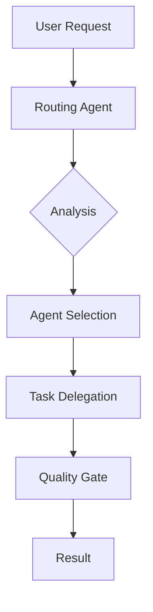

# Routing Agent

**Agent Type:** `routing-agent`
**Primary Function:** Central hub routing for agent task delegation
**Coordination Pattern:** Hub-and-spoke architecture coordinator

## Description

The routing-agent serves as the central orchestrator in the hub-and-spoke agent coordination pattern. It receives all user requests and intelligently routes them to the most appropriate specialized agents based on task requirements, agent capabilities, and current system state.

## Core Responsibilities

- **Request Analysis**: Parse and understand user intent from natural language requests
- **Agent Selection**: Choose optimal agents based on task requirements and capabilities
- **Load Balancing**: Distribute work across available agents to prevent overload
- **Context Preservation**: Maintain session context across multi-agent interactions
- **Quality Assurance**: Ensure proper handoff validation and contract compliance

## Routing Logic

```
User Request → Routing Analysis → Agent Selection → Task Delegation → Quality Gate → Result
```

### Agent Selection Criteria
1. **Task Type Match**: Align request with agent specialization
2. **Capability Assessment**: Verify agent can handle task complexity
3. **Availability Check**: Ensure agent is not overloaded
4. **Context Compatibility**: Match with agents that understand current context

## Specialized Agent Routing

- **Implementation Tasks** → `implementation-agent`, `component-agent`, `feature-agent`
- **Testing Requirements** → `testing-agent`, `tdd-validation-agent`
- **Quality Assurance** → `quality-agent`, `security-agent`
- **Research Needs** → `research-agent`, `metrics-agent`
- **Infrastructure** → `infrastructure-agent`, `devops-agent`
- **Project Management** → `project-manager-agent`, `task-orchestrator`

## Quality Gates

- **Pre-Routing Validation**: Ensure request is well-formed and actionable
- **Agent Capability Check**: Verify selected agent can handle the task
- **Handoff Contract**: Establish clear success criteria before delegation
- **Result Validation**: Confirm task completion meets requirements

## Hub Coordination Patterns

### Request Flow


### Multi-Agent Coordination
- **Sequential Tasks**: Route dependent tasks in proper order
- **Parallel Tasks**: Identify and distribute independent work streams
- **Context Handoff**: Preserve context across agent transitions
- **Conflict Resolution**: Handle competing agent recommendations

## Anti-Patterns (Prevent Direct Agent Communication)

The routing-agent enforces hub-and-spoke architecture by preventing:
- Direct agent-to-agent communication
- Bypassing central coordination
- Context fragmentation across agents
- Unvalidated task handoffs

## Integration Points

- **TaskMaster**: Coordinate with project management workflows
- **Quality Gates**: Enforce validation checkpoints
- **Metrics Collection**: Track routing effectiveness and agent performance
- **Context Preservation**: Maintain session state across interactions

## Usage Examples

```bash
# Natural language routing
"Route this to the appropriate agent: implement user authentication"

# Explicit agent selection
"Use @implementation-agent to create the login system"

# Multi-agent coordination
"Coordinate @testing-agent and @implementation-agent for TDD workflow"
```

## Configuration

The routing-agent behavior can be configured through `.claude/settings.json`:

```json
{
  "routing": {
    "defaultTimeout": 30000,
    "maxRetries": 3,
    "qualityGates": true,
    "contextRetention": 0.95,
    "loadBalancing": "round-robin"
  }
}
```
